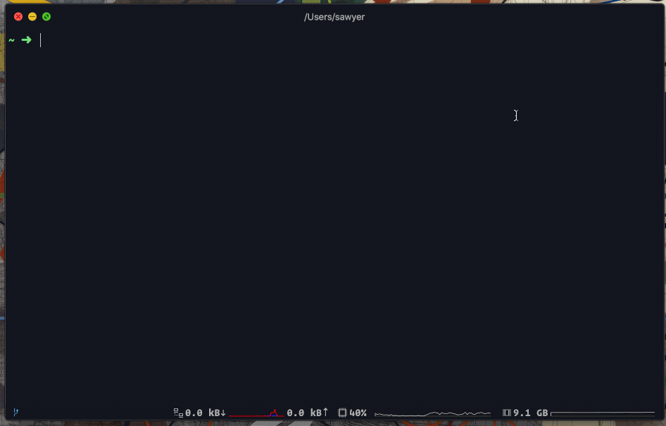

This repo contains my terminal's (zsh + oh-my-zsh + iTerm 2) setup and configuration files ([`dotfiles`](https://dotfiles.github.io)). 

These may be handy for you as well, but will require some minor modifications to tailor it to your system.

## Initial setup

### Prerequisites

1. [`brew` is installed](https://docs.brew.sh/Installation)

### Installation

1. [Set `zsh` to be your default shell](https://support.apple.com/en-us/HT208050)
1. `cd ~`
1. [Install `oh-my-zsh`](https://github.com/robbyrussell/oh-my-zsh#getting-started):
    ```sh
    sh -c "$(curl -fsSL https://raw.githubusercontent.com/robbyrussell/oh-my-zsh/master/tools/install.sh)"
    ```
1. Clone this repo
1. Navigate into the cloned repo:
   ```sh
   cd dotfiles/
   ```
1. Install command line tools and dependencies:
   ```sh
   ./brew.sh
   ```
1. Symlink the configuration files: 
    ```
    ./symlink-setup.sh
    ```
1. Tailor the files for your system. **You'll definitely need to at least edit the `ZSH` path in `.zshrc`**, and may want to edit certain paths in `zsh/aliases.zsh` and `zsh/exports.zsh`. I may be leaving some out, so it wouldn't hurt to just search your `dotfiles` for `sawyer`.
1. Restart your terminal

### iTerm setup

- Install iTerm2 [v**3.3.0beta**](https://www.iterm2.com/downloads.html) or higher
- Import `iterm/iterm-profile.json` from `Preferences → Profiles`. This _should_ automatically import the [color scheme](prefs/soy.itermcolors) too.
- Modify the position of the status bar from `Preferences → Appearance → Status bar location`

> Note: I use [Operator Mono](https://www.typography.com/fonts/operator/styles) as my iTerm2 font. For a free alternative, check out [PT Mono](https://fonts.google.com/specimen/PT+Mono) or [Fira Code](https://github.com/tonsky/FiraCode)

## Favorite parts

- [`aliases.zsh`](zsh/aliases.zsh) includes handy shortcut commands for common NPM and Git tasks, amongst other things. You can view the full list of available aliases by running the `alias` command. Some examples:
    - `ni` to `npm install`
    - `nr` to `npm run`
    - `push` to `git push`
    - `master` to `git checkout master`
    - `gcb BRANCH_NAME` to `git checkout -b BRANCH_NAME`
- [`zsh-autosuggestions`](https://github.com/zsh-users/zsh-autosuggestions) plugin is installed, and shows suggestions as you type. Press the up arrow to accept the suggestion.
- [`z`](https://github.com/rupa/z) is installed, which is a smarter `cd`. It tracks your most used directories, based on 'frecency'. After  a  short  learning  phase, `z` will take you to the most 'frecent' directory. `z` learns only once its installed so you'll have to `cd` around for a bit to teach it. Once you've had it installed for a few days, start navigating to directories by typing `z` from anywhere, followed by a portion of the directory you want to navigate to.
- Other handy navigation shortcuts: `..`, `...`, `....`

## General philosophy

You're not going to find anything super advanced in here. I don't include something unless I know why it's there and only if it makes a noticeable difference in my productivity or enjoyment.

`oh-my-zsh` does a lot of the heavy lifting, and I've tried to avoid introducing unnecessary plugins, aliases, or functions unless I find myself constantly coming back to the same command(s). Beyond navigation, NPM, and Git commands, I don't do much else on the command line. Even with Git, most of my interactions are through [Tower](https://www.git-tower.com/).
